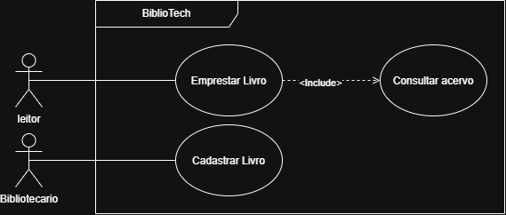

# Atividade 17 — Da esteira ao diagrama (BiblioTech)

- **Aluno(a):** RENAN SOARES DA SILVA
- **Turma:** 2º ano — Técnico em Informática Integrado
- **Disciplina:** Análise e Projeto de Sistemas — Profe. Berssa

## O que tem nesta pasta

| Arquivo | O que é |
|---|---|
| [esteira-da-analise.md](esteira-da-analise.md) | As esteiras e a autoavaliação |
| [diagrama-casos-de-uso.png](Bibliotech.drawio.png) | O diagrama (imagem) |
| [diagrama-casos-de-uso.drawio](Bibliotech.drawio.xml) | O diagrama (arquivo editável) |

## Diagrama

## Conceito pretendido

**Conceito:** A

A justificativa está no fim do arquivo `esteira-da-analise.md`.